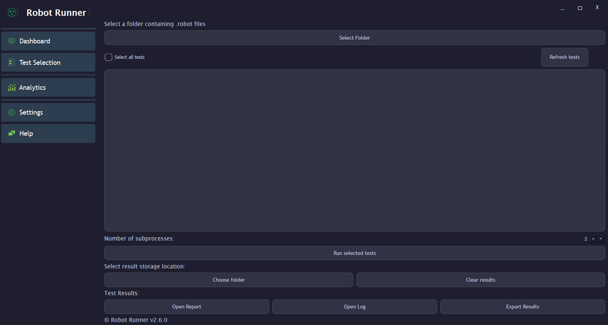
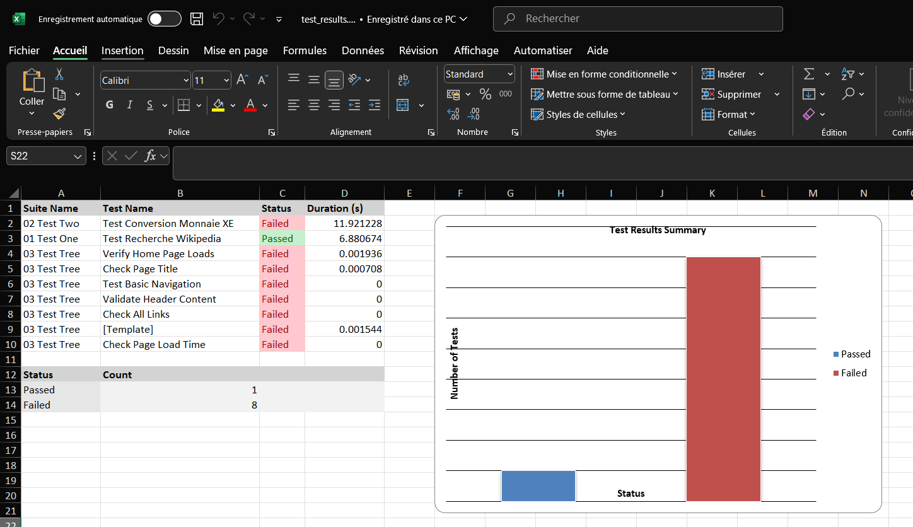

Usage Guide
===========

Overview
--------

This application extends the capabilities of the Robot Framework by providing a modern GUI, detailed reports, and visual test analytics. It is designed to help QA engineers and developers run, monitor, and analyze automated tests efficiently.

Basic Usage
-----------

To execute tests programmatically:

.. code-block:: python

   import robbot
   robbot.run()

This initiates a test execution using the application's built-in engine.

GUI-Based Test Execution
------------------------

Using the GUI, users can:

- Select specific test suites or cases to run
- Monitor test progress in real time
- Filter and search test cases
- Abort execution mid-run if necessary

Log & Report Generation
-----------------------

After execution, the GUI generates:

- A **log file** and a **report file** similar to standard Robot Framework output
- A **visual summary dashboard** with test statistics

Excel Report Export
-------------------

The application can export test results into an Excel file, which includes:

- Execution summary table
- Pie chart of passed/failed/skipped tests
- Histogram of test durations
- Total execution time
- Automatically embedded screenshots or log references (if enabled)

Built-in Analytics
------------------

Within the GUI, users can access analytics views:

- **Pass/Fail trends** over time
- **Failure clustering** and pattern detection
- **Historical data tracking**
- **Average execution time analysis**

This allows teams to detect flaky tests, regressions, or performance bottlenecks.

Graphical Visualization
-----------------------

Charts are rendered directly in the GUI:

- **Pie charts**: Test result distribution
- **Histograms**: Test execution durations
- **Line graphs** (planned): Trend tracking per suite

.. image:: _static/dashboard.png
   :alt: Test Analytics Example
   :width: 600px

Comparison with Traditional Robot Framework
-------------------------------------------

Standard Robot execution:

.. code-block:: bash

   robot tests/

Limitations:

- No built-in GUI
- Minimal reporting unless post-processed
- No analytics or visualization

With This Application:

- GUI-based execution and monitoring
- Enhanced reports with graphics
- Analytics dashboard for QA insights
- Excel export suitable for sharing with teams/stakeholders

Tips and Best Practices
-----------------------

- Run the app in a **virtual environment** to avoid conflicts
- Use **tags and filters** to organize test cases in the GUI
- Export reports regularly to track **historical performance**
- Review pie/histogram charts to **spot instability early**