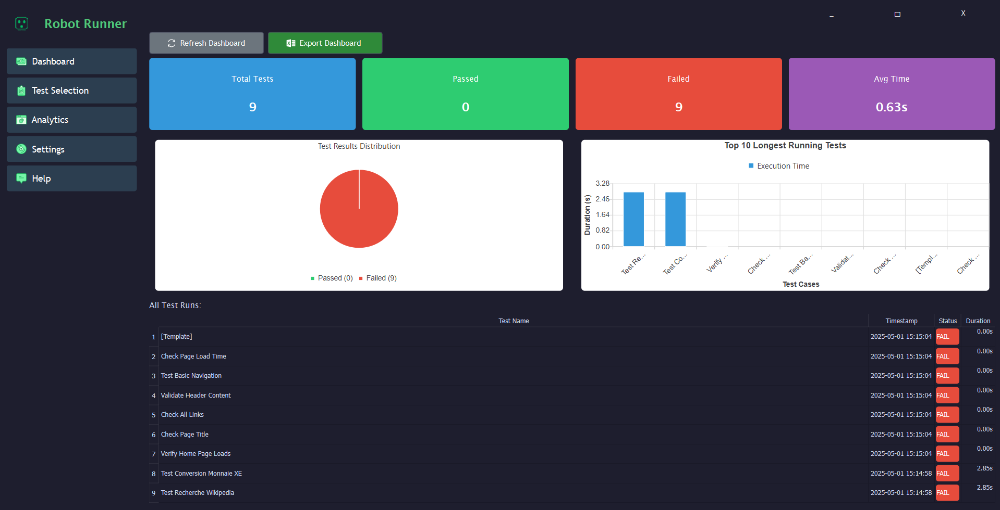

Usage Guide
===========

Overview
----------

ROBOT-RUNNER provides a comprehensive GUI interface for managing Robot Framework test executions, offering enhanced visualization, analytics, and reporting capabilities beyond the standard Robot Framework CLI tools.

Application Layout
-------------------

The interface is organized into five main sections accessible via the left sidebar:

Dashboard Section
------------------

**Key Metrics Panel**

- Total tests executed
- Pass/Fail/Skipped counts
- Total execution time
- Average test duration

**Visualizations**

1. Result Distribution Pie Chart:
   - Shows percentage of passed/failed/skipped tests
   - Color-coded (green=passed, red=failed, yellow=skipped)

2. Execution Time Histogram:
   - Groups tests by duration ranges
   - Identifies performance outliers

**Test Summary Table**

Lists all test cases with columns:
- Test name
- Status (with color indicators)
- Execution duration
- Timestamp

**Action Buttons**

- :guilabel:`Refresh`: Reloads current dashboard data
- :guilabel:`Export to Excel`: Generates comprehensive report containing:
  - All dashboard metrics
  - Visualizations as embedded charts
  - Raw test data table

Test Selection Section
-----------------------

**File Browser Panel**

- Directory tree navigation
- Automatic detection of Robot test files (``.robot``)
- Visual indicators for test file validity

**Execution Controls**

- :guilabel:`Select Folder`: Choose test directory
- :guilabel:`Clear Results`: Reset previous execution data
- :guilabel:`Run Tests`: Start test execution with options:
  - Number of parallel processes (1-8)
  - Tag filtering
  - Test suite selection

**Execution Summary**

Real-time counter showing:
- Total tests
- Passed/Failed counts
- Current status

**Report Access**

- :guilabel:`Open HTML Report`: Standard Robot Framework report
- :guilabel:`Open Log`: Detailed execution log
- :guilabel:`Export to Excel`: Custom report with:
  - Test case details
  - Screenshots of failures (if configured)
  - Performance metrics

Analytics Section
------------------

**Test Execution Trends**

- Line chart showing pass/fail rates over time
- Configurable time periods (7/30/90 days)

**Status Distribution**

- Stacked bar chart of test outcomes
- Filterable by test suite/tag

**Top Failure Reasons**

- Pareto chart of most common failure messages
- Links to relevant test cases

**Execution Time Analysis**

- Box plot of duration distribution
- Identifies flaky tests (high duration variance)

**Controls**

- :guilabel:`Refresh`: Update analytics data
- :guilabel:`Export Analytics`: Excel report containing:
  - All charts as images
  - Raw data tables
  - Statistical summaries

Settings Section
-----------------

**Execution Settings**

- Default test directory
- Parallel process count
- Timeout thresholds
- Environment variables

**Reporting Options**

- Report generation preferences
- Excel export settings
- Screenshot capture configuration

**UI Preferences**

- Theme selection (light/dark)
- Font size adjustment
- Layout customization

Help Section
-------------

**Resources**

- :guilabel:`Report Bugs`: Link to issue tracker
- :guilabel:`Source Code`: GitHub repository link
- :guilabel:`Documentation`: User manual and API reference
- :guilabel:`Donate`: Support options

Advanced Features
------------------

**Custom Report Templates**

- Create and apply custom Excel report formats
- Define which metrics to include
- Auto-email reports (Enterprise feature)

**Integration Hooks**

- Pre/post execution scripts
- API endpoints for CI/CD integration
- Webhook notifications

**Data Export Formats**

- Excel (default)
- JSON (for programmatic use)
- PDF (for formal reports)

Comparison with Standard Robot Framework
-----------------------------------------

+--------------------------+-------------------------------+----------------------------------+
| Feature                  | Standard Robot Framework      | ROBOT-RUNNER                     |
+==========================+===============================+==================================+
| Interface                | Command-line only             | Graphical User Interface         |
+--------------------------+-------------------------------+----------------------------------+
| Real-time Monitoring     | Limited (text output)         | Visual dashboard with progress   |
+--------------------------+-------------------------------+----------------------------------+
| Reporting                | Basic HTML                    | Enhanced HTML + Excel + PDF      |
+--------------------------+-------------------------------+----------------------------------+
| Analytics                | None                          | Built-in visualization tools     |
+--------------------------+-------------------------------+----------------------------------+
| Historical Tracking      | Manual                        | Automatic trend analysis         |
+--------------------------+-------------------------------+----------------------------------+

Best Practices
---------------

1. **Workspace Organization**
   - Keep test cases in well-structured directories
   - Use consistent naming conventions

2. **Execution Tips**
   - Start with small test batches when debugging
   - Use parallel execution for large test suites
   - Review analytics regularly to spot trends

3. **Reporting**
   - Export reports after major test changes
   - Use custom templates for different stakeholders
   - Archive important execution results

Troubleshooting
----------------

**Common Issues**

1. *Tests not appearing in selection*:
   - Verify files have ``.robot`` extension
   - Check file contains valid Robot syntax

2. *Performance problems*:
   - Reduce parallel processes
   - Increase timeout thresholds

3. *Reporting errors*:
   - Ensure write permissions for output directory
   - Verify Excel is installed (for Excel export)